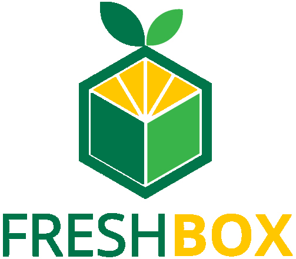
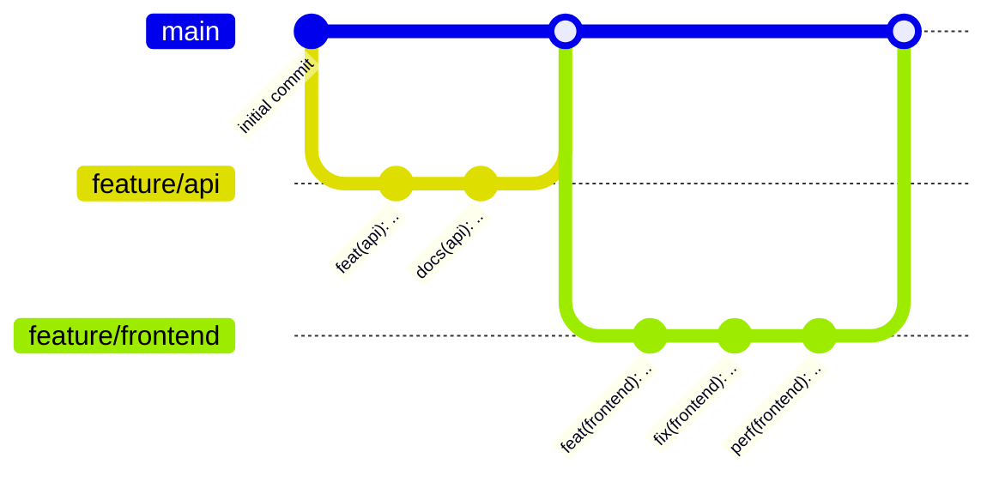

<a name="readme-top"></a>


<!-- PROJECT LOGO -->
<br />
<div align="center">
  <a href="https://github.com/depp57/freshbox">
    
  </a>

<h3 align="center">Freshbox</h3>

  <p align="center">
    A microservices-based web application, made for learning purpose.
    <br />
    <br />
    <br />
    <a href="https://github.com/github_username/repo_name">Explore the docs</a>
    ·
    <a href="https://freshbox.sachathommet.fr">View an online demo</a>
  </p>
</div>


<!-- TABLE OF CONTENTS -->
<details>
  <summary>Table of Contents</summary>
  <ol>
    <li>
      <a href="#about-the-project">About The Project</a>
      <ul>
        <li><a href="#built-with">Built With</a></li>
      </ul>
    </li>
    <li>
      <a href="#getting-started">Getting Started</a>
      <ul>
        <li><a href="#prerequisites">Prerequisites</a></li>
        <li><a href="#installation">Installation</a></li>
      </ul>
    </li>
    <li><a href="#contact">Contact</a></li>
    <li><a href="#acknowledgments">Acknowledgments</a></li>
    <li><a href="#license">License</a></li>
  </ol>
</details>


## About The Project

[![Product Name Screen Shot][product-screenshot]](https://freshbox.sachathommet.fr)

I built this project for learning purpose.

Some things could be bad, over-engineered, not well understood. However, I tried to do my best as a
computer science student.

I explained my choices whenever I thought it is interesting.

## Explanation of the choices I made

### Security

#### 1. SSL encryption using HTTPS between the client and the API-gateway

HTTPS is crucial for secure communication between clients and web apps. The main advantages it procures is **encryption of the data transmitted between the client's web browser
and the web app** and **authentication of the identity of the web app server**.

I opted for a [self-signed SSL certificate](https://stackoverflow.com/questions/10175812/how-to-generate-a-self-signed-ssl-certificate-using-openssl)
to encrypt the communication between the web application and the user. However, it's important to note that **self-signed certificates are not suitable
for production environments**. To enhance security, I recommend using a trusted SSL certificate from a certificate authority like [Let's Encrypt](https://letsencrypt.org/),
which offers free certificates. Then, you can use a tool like [Certbot](https://certbot.eff.org/) to automatically renew your certificate.

### Clean code

I love the [Software craftmanship](https://en.wikipedia.org/wiki/Software_craftsmanship) approach of coding.
I try to deliver the best code quality, and this is why I choose some tools to help me:

- TODO explain my Git Flow here



- TODO list all the guidelines ect.

<p align="right">(<a href="#readme-top">back to top</a>)</p>

### Built With

* [![Angular][Angular.io]][Angular-url]
* [![NestJs][NestJs]][NestJs-url]
* [![Docker][Docker]][Docker-url]
* [![Nginx][Nginx]][Nginx-url]
* [![PostgreSQL][PostgreSQL]][PostgreSQL-url]
* [![Jetbrains][Jetbrains]][Jetbrains-url]

<p align="right">(<a href="#readme-top">back to top</a>)</p>


<!-- GETTING STARTED -->
## Getting Started

### Prerequisites

This is an example of how to list things you need to use the software and how to install them.
* [![Docker][Docker]][Docker-url] version 20.10 or latest

### Installation

TODO explain how to install the project ..

1. Get a free API Key at [https://example.com](https://example.com)
2. Clone the repo
   ```sh
   git clone https://github.com/github_username/repo_name.git
   ```
3. Install NPM packages
   ```sh
   npm install
   ```
4. Enter your API in `config.js`
   ```js
   const API_KEY = 'ENTER YOUR API';
   ```

<p align="right">(<a href="#readme-top">back to top</a>)</p>


<!-- CONTACT -->
## Contact

- [![LinkedIn][LinkedIn]][LinkedIn-url]
- [![Portfolio][Portfolio]][Portfolio-url]
- [![Github][Github]][Github-url]
- Email : sachathommet5@orange.fr

<p align="right">(<a href="#readme-top">back to top</a>)</p>


<!-- ACKNOWLEDGMENTS -->
## Acknowledgments

* [Jetbrains for their great IDE](https://www.jetbrains.com/)

<p align="right">(<a href="#readme-top">back to top</a>)</p>


<!-- LICENSE -->
## License

Distributed under the MIT License. See `LICENSE.txt` for more information.

<p align="right">(<a href="#readme-top">back to top</a>)</p>


<!-- MARKDOWN LINKS & IMAGES -->
<!-- https://www.markdownguide.org/basic-syntax/#reference-style-links -->
[product-screenshot]: trello.png
[product-url]: https://freshbox.sachathommet.fr
[Linkedin]: https://img.shields.io/badge/LinkedIn-0A66C2?style=for-the-badge&logo=LinkedIn&logoColor=white
[Linkedin-url]: https://fr.linkedin.com/in/sacha-thommet
[Angular.io]: https://img.shields.io/badge/Angular-DD0031?style=for-the-badge&logo=angular&logoColor=white
[Angular-url]: https://angular.io/
[Nestjs]: https://img.shields.io/badge/NestJS-E0234E?style=for-the-badge&logo=NestJS&logoColor=white
[Nestjs-url]: https://nestjs.com/
[Docker]: https://img.shields.io/badge/Docker-2496ED?style=for-the-badge&logo=Docker&logoColor=white
[Docker-url]: https://www.docker.com/
[Nginx]: https://img.shields.io/badge/NGINX-009639?style=for-the-badge&logo=NGINX&logoColor=white
[Nginx-url]: https://www.nginx.com/
[PostgreSQL]: https://img.shields.io/badge/PostgreSQL-4169E1?style=for-the-badge&logo=PostgreSQL&logoColor=white
[PostgreSQL-url]: https://www.postgresql.org/
[Jetbrains]: https://img.shields.io/badge/Webstorm_IDE-000000?style=for-the-badge&logo=Jetbrains&logoColor=white
[Jetbrains-url]: https://www.jetbrains.com/
[Portfolio]: https://img.shields.io/badge/Portfolio-000000?style=for-the-badge&logo=Prettier&logoColor=white
[Portfolio-url]: http://sachathommet.fr/
[Github]: https://img.shields.io/badge/Github-181717?style=for-the-badge&logo=Github&logoColor=white
[Github-url]: https://github.com/depp57
