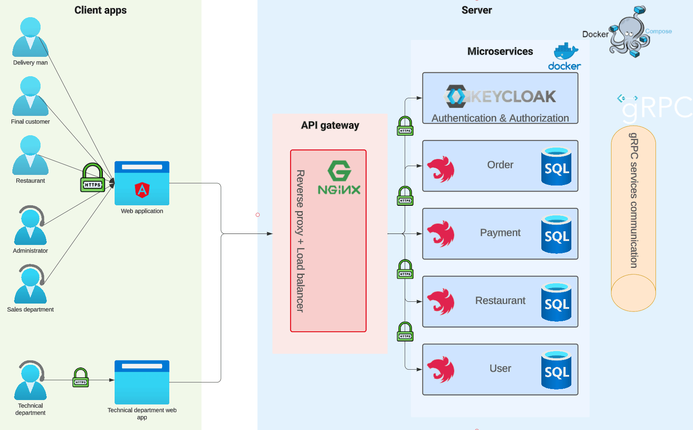
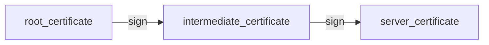
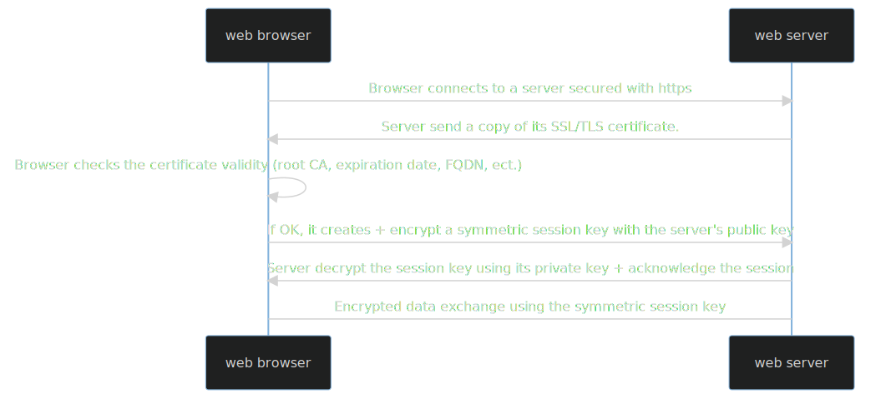
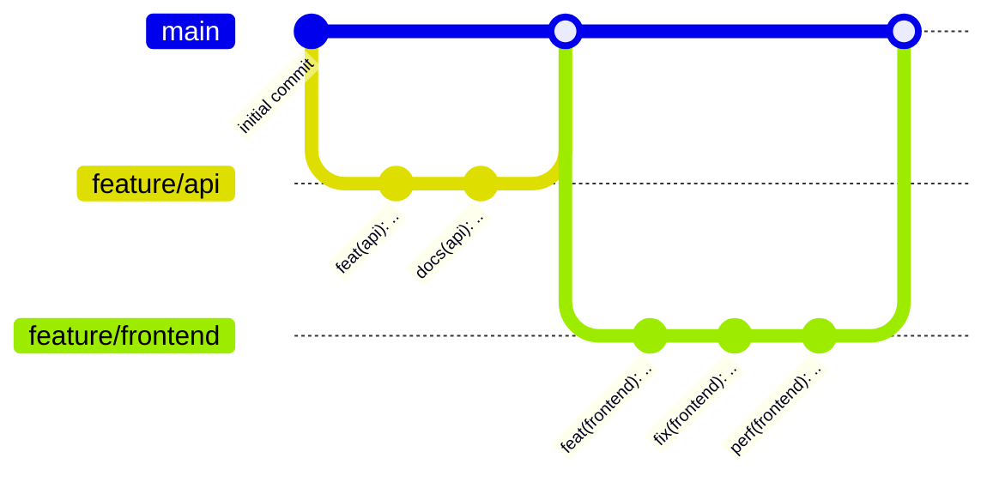

<a name="readme-top"></a>


<!-- PROJECT LOGO -->
<br />
<div align="center">
  <a href="https://github.com/depp57/freshbox">
    
  </a>

<h3 align="center">Freshbox</h3>

  <p align="center">
    A microservices-based web application, made for learning purpose.
    <br />
    <br />
    <br />
    <a href="https://github.com/github_username/repo_name">Explore the docs</a>
    ·
    <a href="https://freshbox.sachathommet.fr">View an online demo</a>
  </p>
</div>


<!-- TABLE OF CONTENTS -->
<details>
  <summary>Table of Contents</summary>
  <ol>
    <li>
      <a href="#about-the-project">About The Project</a>
      <ul>
        <li><a href="#built-with">Built With</a></li>
      </ul>
    </li>
    <li>
      <a href="#getting-started">Getting Started</a>
      <ul>
        <li><a href="#prerequisites">Prerequisites</a></li>
        <li><a href="#installation">Installation</a></li>
      </ul>
    </li>
    <li><a href="#contact">Contact</a></li>
    <li><a href="#acknowledgments">Acknowledgments</a></li>
    <li><a href="#license">License</a></li>
  </ol>
</details>


## About The Project

[![Product Name Screen Shot][product-screenshot]](https://freshbox.sachathommet.fr)

I built this project for learning purpose.

Some things could be bad, over-engineered, not well understood. However, I tried to do my best as a
computer science student.

I explained my choices whenever I thought it is interesting.

## Explanation of the choices I made

### Security

#### 1. Secure Communication with HTTPS and SSL Encryption

I implemented SSL/TLS encryption between the client and the API gateway, and between all microservices inside the Docker's
network.
I opted for an SSL/TLS certificate signed by [LetsEncrypt](https://letsencrypt.org) - a trusted *Certificate Authority*.



*NB*: you can use a tool like [Certbot](https://certbot.eff.org/) to automatically renew your certificate.

<details>
  <summary>My Explanation of how HTTPS works</summary>

1. Request a certificate
   1. Create a Certificate Signing Request (CSR) with your company information (FQDN, email, name, ect.).
   2. Send it to the Certificate Authority (CA).
   3. The CA will perform a DNS challenge (usually check if a TXT record exists), to ensure the provided FQDN belongs to you.
   4. If the challenge succeed, the CA send you back your certificate signed by the CA's root certificate.

2. Serve the certificate


<div align="center"><i>Certificate chain, in this case the root certificate belongs to LetsEncrypt</i></div>



<div align="center"><i>An HTTPS session</i></div>

</details>

#### 2. Keycloak authentication and authorization

Keycloak, an open-source tool backed by RedHat, is used in this project to manage the authentication and authorization process.
It is widely recognized and known for implementing standard security protocols, like OpenID in the case of Freshbox.

It comes with a lot of advantages:
- **Role-Based Access Control (RBAC)**: a method of regulating access to resources based on the roles of individual users within the project.
- **Single Sign-On (SSO)**: a property that allows users to log in with a single ID and password to gain access to a connected system.
- **Social Logins**: offers users the ability to authenticate using social networks. For instance, Freshbox users can conveniently log in using Google.
- **User Federation**: capability to connect with existing LDAP or Active Directory servers.
- **User-Friendly Admin Dashboard**: provides an interface for managing users, roles, and permissions.

Here is an illustration summarizing the integration of Keycloak into Freshbox:


As explained in the illustration: I opted for offline token validation. While this choice restricts token revocation,
it eases the network load by allowing all microservices to validate tokens locally, eliminating the need for calls to Keycloak.

---

### Clean code

I love the [Software craftmanship](https://en.wikipedia.org/wiki/Software_craftsmanship) approach of coding.
I try to deliver the best code quality, and this is why I choose some tools to help me:

- TODO explain my Git Flow here



- TODO list all the guidelines ect.

<p align="right">(<a href="#readme-top">back to top</a>)</p>

### Built With

* [![Angular][Angular.io]][Angular-url]
* [![NestJs][NestJs]][NestJs-url]
* [![Docker][Docker]][Docker-url]
* [![Nginx][Nginx]][Nginx-url]
* [![PostgreSQL][PostgreSQL]][PostgreSQL-url]
* [![Jetbrains][Jetbrains]][Jetbrains-url]

<p align="right">(<a href="#readme-top">back to top</a>)</p>


<!-- GETTING STARTED -->
## Getting Started

### Prerequisites

This is an example of how to list things you need to use the software and how to install them.
* [![Docker][Docker]][Docker-url] version 20.10 or latest

### Installation

TODO explain how to install the project ..

1. Get a free API Key at [https://example.com](https://example.com)
2. Clone the repo
   ```sh
   git clone https://github.com/github_username/repo_name.git
   ```
3. Install NPM packages
   ```sh
   npm install
   ```
4. Enter your API in `config.js`
   ```js
   const API_KEY = 'ENTER YOUR API';
   ```

<p align="right">(<a href="#readme-top">back to top</a>)</p>


<!-- CONTACT -->
## Contact

- [![LinkedIn][LinkedIn]][LinkedIn-url]
- [![Portfolio][Portfolio]][Portfolio-url]
- [![Github][Github]][Github-url]
- Email : sachathommet5@orange.fr

<p align="right">(<a href="#readme-top">back to top</a>)</p>


<!-- ACKNOWLEDGMENTS -->
## Acknowledgments

* [Jetbrains for their great IDE](https://www.jetbrains.com/)

<p align="right">(<a href="#readme-top">back to top</a>)</p>


<!-- LICENSE -->
## License

Distributed under the MIT License. See `LICENSE.txt` for more information.

<p align="right">(<a href="#readme-top">back to top</a>)</p>


<!-- MARKDOWN LINKS & IMAGES -->
<!-- https://www.markdownguide.org/basic-syntax/#reference-style-links -->
[product-screenshot]: docs/trello.png
[product-url]: https://freshbox.sachathommet.fr
[Linkedin]: https://img.shields.io/badge/LinkedIn-0A66C2?style=for-the-badge&logo=LinkedIn&logoColor=white
[Linkedin-url]: https://fr.linkedin.com/in/sacha-thommet
[Angular.io]: https://img.shields.io/badge/Angular-DD0031?style=for-the-badge&logo=angular&logoColor=white
[Angular-url]: https://angular.io/
[Nestjs]: https://img.shields.io/badge/NestJS-E0234E?style=for-the-badge&logo=NestJS&logoColor=white
[Nestjs-url]: https://nestjs.com/
[Docker]: https://img.shields.io/badge/Docker-2496ED?style=for-the-badge&logo=Docker&logoColor=white
[Docker-url]: https://www.docker.com/
[Nginx]: https://img.shields.io/badge/NGINX-009639?style=for-the-badge&logo=NGINX&logoColor=white
[Nginx-url]: https://www.nginx.com/
[PostgreSQL]: https://img.shields.io/badge/PostgreSQL-4169E1?style=for-the-badge&logo=PostgreSQL&logoColor=white
[PostgreSQL-url]: https://www.postgresql.org/
[Jetbrains]: https://img.shields.io/badge/Webstorm_IDE-000000?style=for-the-badge&logo=Jetbrains&logoColor=white
[Jetbrains-url]: https://www.jetbrains.com/
[Portfolio]: https://img.shields.io/badge/Portfolio-000000?style=for-the-badge&logo=Prettier&logoColor=white
[Portfolio-url]: http://sachathommet.fr/
[Github]: https://img.shields.io/badge/Github-181717?style=for-the-badge&logo=Github&logoColor=white
[Github-url]: https://github.com/depp57
